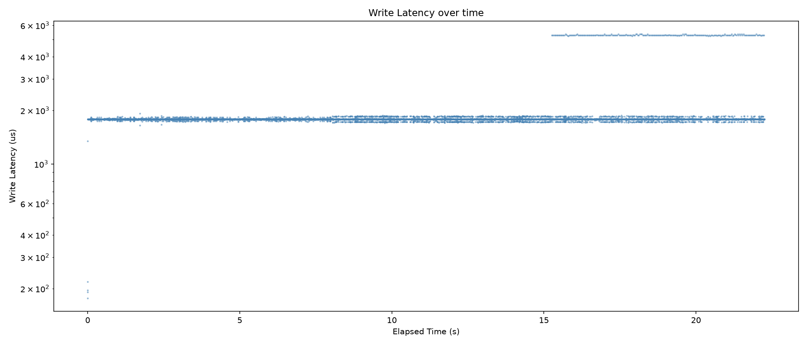
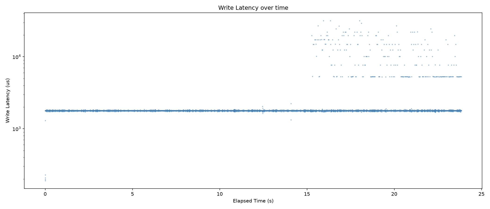

# NVMeV GC: Greedy vs FIFO
### 순차/랜덤 쓰기 조건에서의 victim 선택 정책 비교

---

## 목적 및 진행 순서

**목적**: 순차 쓰기에서는 Greedy(vpc)가 결과적으로 FIFO처럼 동작한다는 가설을, `write_seq` 기록 → FIFO 구현 → 랜덤 쓰기 전환의 3단계로 검증

1. **검증 코드 작성**: line이 몇 번째로 마감됐는지 기록하는 `write_seq` 추가, victim 선택 순서가 오름차순인지 확인
2. **FIFO 구현 후 비교**: 같은 조건(순차 쓰기)에서 Greedy 결과와 동일한지 비교 → 같으면 가설 검증 완료, 다르면 원인 분석
3. **Random Write 전환**: 순차 쓰기로는 두 정책이 구분되지 않으므로, 랜덤 쓰기로 전환해 실제 차이 확인

**추출 데이터**: write_seq 시퀀스, GC 발생 횟수(`gc_count`), rmmod 시점 최종 상태(`tt_lines`, `full_line_cnt`, `free_line_cnt`, `write_credits`, `victim_line_cnt`)

---

## 수정 코드 (1) — 구조체 & 정책 스위치

**conv_ftl.h**
```C
struct line {
    ...
    uint64_t write_seq;   // 추가: line이 몇 번째로 마감됐는지
};
struct conv_ftl {
    ...
    uint64_t line_seq_counter;   // 추가: line 마감마다 증가하는 전역 카운터
};
```

**conv_ftl.c 최상단** — GC 정책 스위치
```C
#define GC_POLICY_FIFO 1   // 1=FIFO, 0=greedy
```

**Victim 우선순위**: `GC_POLICY_FIFO`면 `write_seq`, 아니면 기존 `vpc`를 pqueue 우선순위로 사용 (`victim_line_get/set_pri`)

---

## 수정 코드 (2) — 핵심 로직 변경

**mark_page_invalid()** — FIFO는 재정렬 시 `write_seq`가 `vpc-1`로 오염되는 문제 발견 → `line->vpc--`만 직접 수행 (greedy는 기존 `pqueue_change_priority` 유지)

**advance_write_pointer()** — line 마감 시 `write_seq = conv_ftl->line_seq_counter++` 부여 (full_line_list / victim pqueue 진입 양쪽 모두)

**do_gc()** — GC 이벤트 로그에 `write_seq` 추가, `gc_count++`
```
GC-ing line:%d,ipc=%d(%d),victim=%d,full=%d,free=%d,write_seq=%llu
```

---

## 실행 스크립트 정보

**ssd_config.h**
```C
#define SSD_PARTITIONS (1)
#define NAND_CHANNELS (1)
#define LUNS_PER_NAND_CH (1)
```

**insmod.sh**: `memmap_size=32G`

**GC 유발 fio 스크립트**
- precondition: 디스크를 (거의) 가득 채워 free_line을 최소 수준까지 소모
- `seq_gc_invoke.sh` / random 버전: precondition 이후 추가 write로 GC 실제 유발
```
--rw=write(또는 randwrite) --bs=256k --size=3000M
```

---

## 결과 (1) — 순차 쓰기, Greedy vs FIFO

| 항목                              | Greedy(vpc)               | FIFO                    |
| ------------------------------- | ------------------------- | ----------------------- |
| write_seq 순서                    | 완전 오름차순 (0,1,3,7,...,739) | 완전 오름차순 (0,1,2,...,217) |
| gc_count                        | 218                       | 218                     |
| free_line_cnt / victim_line_cnt | 3 / 532                   | 3 / 532                 |
| clat p99 / p99.9 / max          | 5211 / 5342 / 5320 us     | 5211 / 5211 / 5286 us   |

동일한 GC 발생 횟수·선택 순서 패턴·거의 동일한 latency 분포
→ **순차 쓰기 조건에서는 Greedy(vpc)와 FIFO가 사실상 동일하게 동작**

---

## 결과 (2) — 순차 쓰기 Latency 그래프

precondition 구간(0~15초, ~1700us대 평탄) → seq_gc_invoke 진입 후(15초 이후) GC로 인한 latency가 약 5500~5600us 수준으로 계단식 상승, Greedy/FIFO 유사한 패턴



---

## 결과 (3) — 랜덤 쓰기, Greedy vs FIFO

| 항목 | Random, Greedy | Random, FIFO |
|---|---|---|
| write_seq 순서 | 불규칙(무작위) | 완전 오름차순 |
| gc_count | 218 | **255** |
| free_line_cnt / victim_line_cnt | 3 / 532 | 2 / 533 |
| clat p99 / p99.9 / max | 5211 / 5276 / 5323 us | **10028 / 22152 / 31693 us** |

- **Greedy**: 그 순간의 vpc만 보고 victim을 고름 → 워크로드 무관하게 GC 총량·최종 free space 동일
- **FIFO**: "가장 먼저 채워진 line"을 기계적으로 고름 → valid 데이터가 많이 남은 line도 선택 → GC 218회 → 255회로 증가

---

## 결과 (4) — 랜덤 쓰기 Latency 그래프

Random·Greedy는 Seq와 거의 동일한 형태(15초 이후 ~5500us 평탄 상승)

Random·FIFO는 15초 이후 8000~30000us 범위로 넓게 산개, 스파이크 폭이 훨씬 크고 불규칙



---

## 결론

- **순차 쓰기**: Greedy(vpc)와 FIFO(write_seq)가 사실상 동일한 line을 선택, 큰 차이 없음
- **랜덤 쓰기**:
  1. Greedy는 "정리 비용이 가장 싼 line"을 우선 → GC 총량이 워크로드와 무관하게 안정적(218회)
  2. FIFO는 정리 비용을 고려하지 않고 오래된 순서만 따름 → GC 횟수 255회, tail latency 최대 31.7ms(Greedy 대비 약 6배)

**즉, FIFO는 항상 write_seq 순으로 victim을 고르므로 "정리 비용을 고려하지 않는다"는 점이 랜덤 워크로드에서 성능 저하로 직접 드러남**
